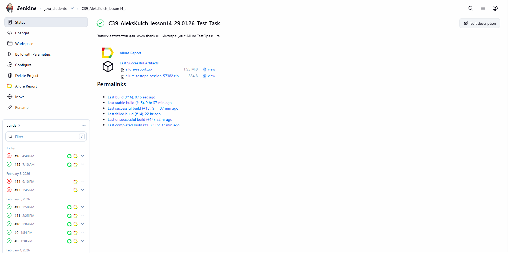
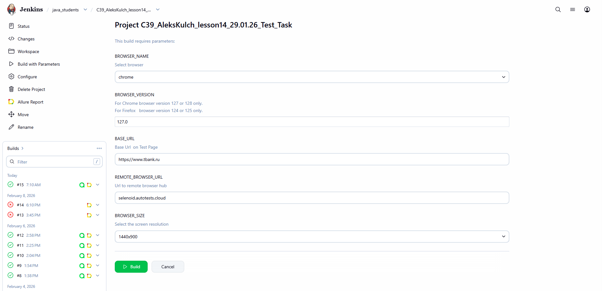
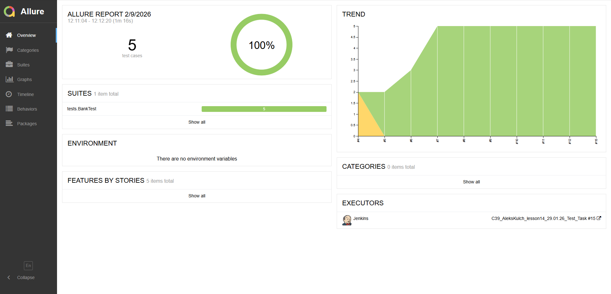
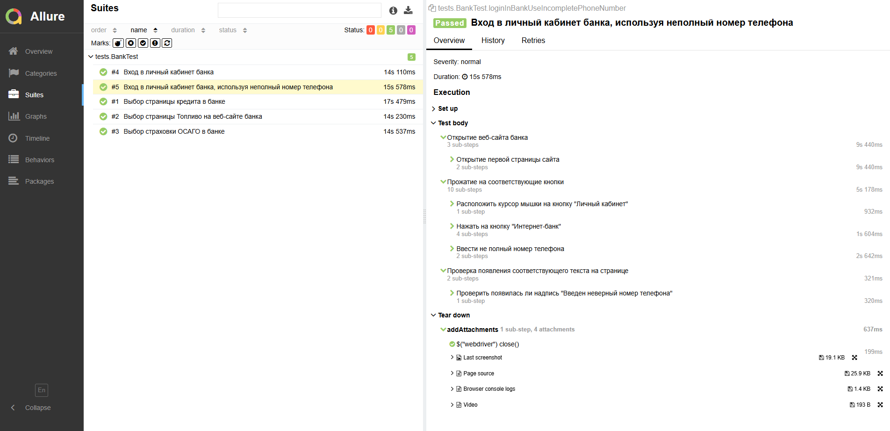
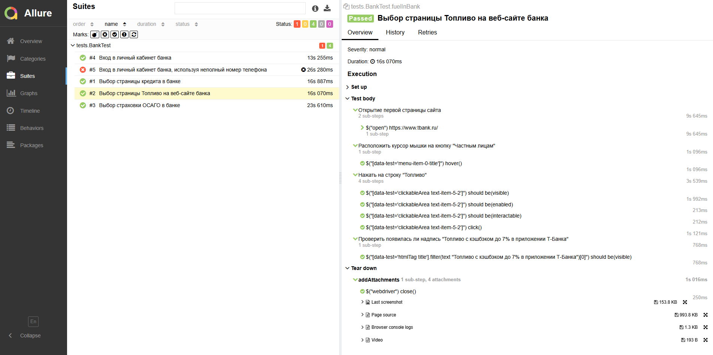
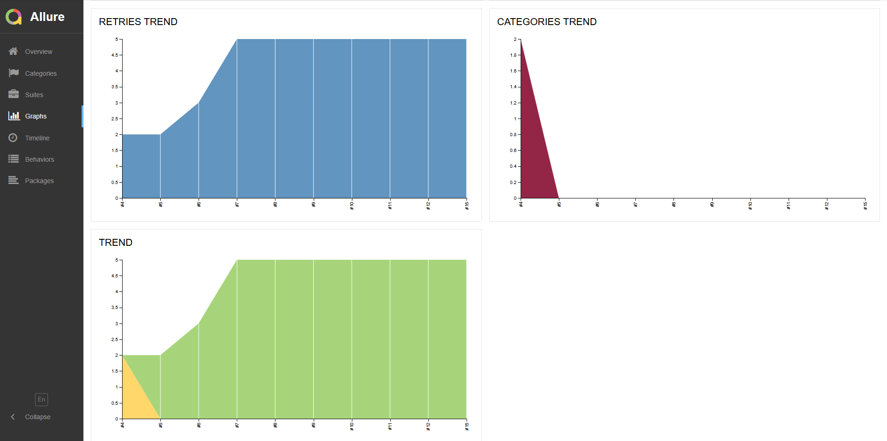
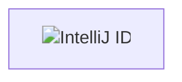
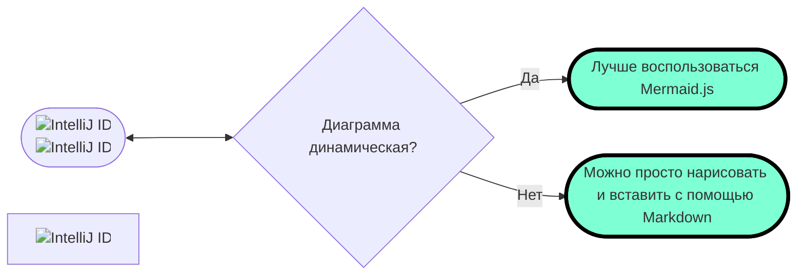

# Проект по автоматизации тестовых сценариев для Т-Банка
## :card_index_dividers: Содержание:

- [Использованный стек технологий и инструментов](#tech-stack)
- [Запуск автотестов](#arrow_forward-запуск-автотестов)
- [Сборка в Jenkins](#-сборка-в-jenkins)
- [Allure Report](#-allure-report)
- [Интеграция с Allure TestOps](#-интеграция-с-allure-testops)  
- [Интеграция с Jira](#-интеграция-с-jira)
- [Уведомления в Telegram](#-уведомления-в-telegram)
- [Видео примера запуска тестов в Selenoid](#-видео-примера-запуска-тестов-в-selenoid)

## <span id="tech-stack"> :computer: Использованный стек технологий и инструментов

<p align="center">


</p>

- В данном проекте автотесты написаны на языке <code>Java</code> с использованием фреймворка для автоматизации тестирования веб‑приложений [Selenide](https://selenide.org/).
- В качестве сборщика был использован - <code>Gradle</code>.
- В качестве фреймворка модульного тестирования задействован <code>JUnit 5</code>.
- При прогоне тестов браузер запускается в [Selenoid](https://aerokube.com/selenoid/).
- Для удаленного запуска реализована джоба в **Jenkins** с формированием Allure-отчета и отправкой результатов в **Telegram** при помощи бота.
- Осуществлена интеграция с **Allure TestOps** и **Jira**


## :arrow_forward: Запуск автотестов

### Локальный запуск тестов из терминала

```bash
./gradlew clean test
```

### Удалённый запуск осуществляется через Jenkins

При необходимости также можно переопределить параметры запуска

```bash
clean
test
-DremoteUrl=${SELENOID_URL}
-DbaseUrl=${BASE_URL}
-DbrowserSize=${BROWSER_SIZE}
-Dbrowser=${BROWSER_NAME}
-Dbrowser_version="${BROWSER_VERSION}"
```

### Параметры сборки

- <code>BROWSER_NAME</code> – браузер, в котором будут выполняться тесты.
- <code>BROWSER_VERSION</code> – версия браузера, в которой будут выполняться тесты.
- <code>BROWSER_SIZE</code> – размер окна браузера, в котором будут выполняться тесты.
- <code>BASE_URL</code> – Url, по которому будет открываться тестируемое приложение.
- <code>REMOTE_BROWSER_URL</code> – адрес удаленного сервера, на котором будут запускаться тесты.

##  Сборка в [Jenkins](https://jenkins.autotests.cloud/job/Kod3ik_qa_guru_x5/)
### Главная страница
<p align="center">

</p>

### Страница запуска с возможностью изменить параметры
<p align="center">

</p>

##  Allure [Report](https://jenkins.autotests.cloud/job/Kod3ik_qa_guru_x5/allure/)

Содержание Allure-отчета:

- Шаги теста;
- Скриншот страницы на последнем шаге;
- Page Source;
- Логи браузерной консоли;
- Видео выполнения автотеста.

### Overview

<p align="center">

</p>

### Результат выполнения теста / Тест-кейсы

<p align="center">

</p>

### *Графики*

  <p align="center">  


<p align="center">
  
</p>

##  Интеграция с [Allure TestOps](https://allure.autotests.cloud/project/5108/dashboards)

Результаты выполнения автотестов в сборке <code>Jenkins</code> передаются в <code>Allure TestOps</code>

На Dashboard в <code>Allure TestOps</code> отображена статистика пройденных тестов.

### Dashboard
<p align="center">

</p>

### Результат выполнения автотеста
<p align="center">

</p>

##  Интеграция с [Jira](https://jira.autotests.cloud/browse/HOMEWORK-1574)

Реализована интеграция <code>Allure TestOps</code> с <code>Jira</code>, в тикете отображается информация, какие тест-кейсы были написаны в рамках задачи и результат их прогона.

<p align="center">

</p>

##  Уведомления в Telegram

После завершения сборки, бот созданный в <code>Telegram</code>, автоматически обрабатывает и отправляет сообщение с результатом пройденных тестов.

<p align="center">

</p>

##  Видео примера запуска тестов в Selenoid

К каждому тесту в отчете прилагается видео прогона.
<p align="center">
  
</p>


::: mermaid
graph TD;
    A-->B;
    A-->C;
    B-->D;
    C-->D;
:::


